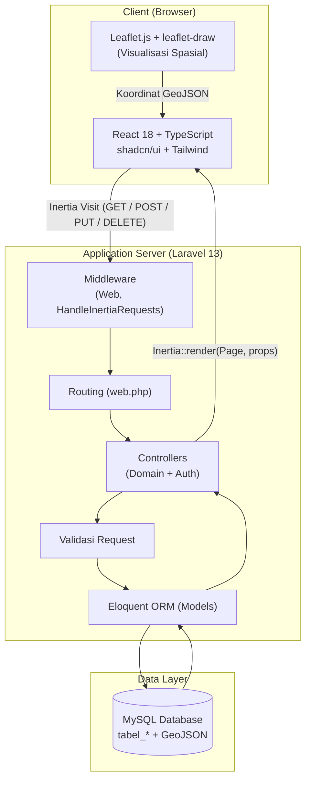
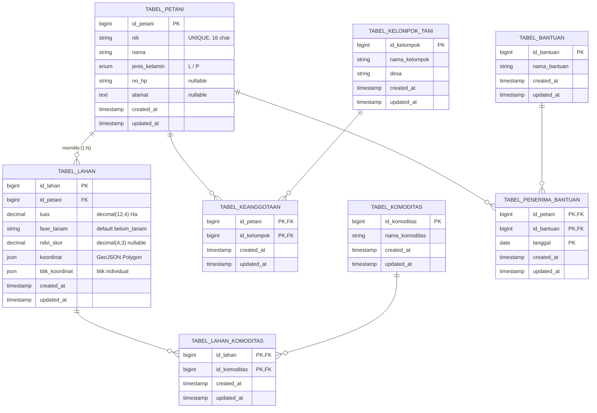
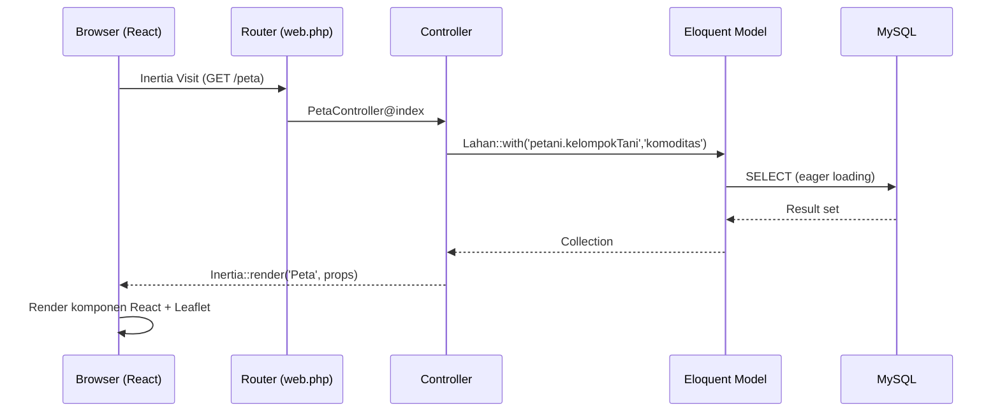
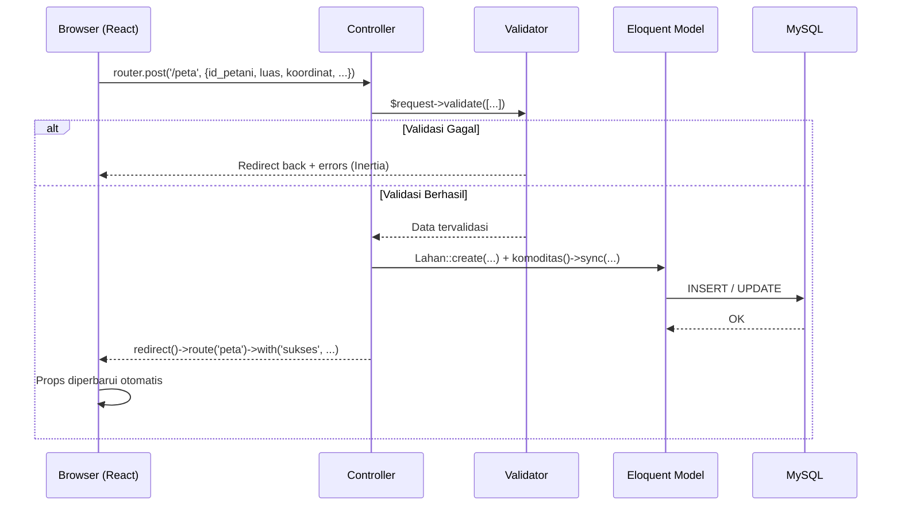
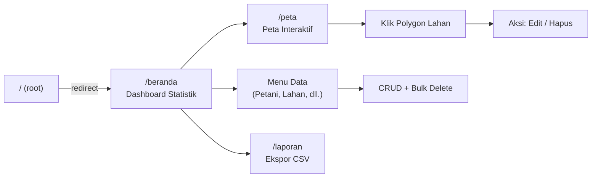

# Dokumen Tinjauan Arsitektur (Architecture Review Document)

## Sistem Informasi Geografis Berbasis Web (WebGIS) — BPP Kecamatan Telaga

| Atribut | Keterangan |
|---|---|
| **Nama Proyek** | WebGIS AgriGIS — Balai Penyuluhan Pertanian (BPP) Kecamatan Telaga |
| **Lokasi Studi** | Kecamatan Telaga, Kabupaten Gorontalo |
| **Jenis Dokumen** | Architecture Review Document (ARD) |
| **Status** | Draft untuk Diskusi Tim Architect |
| **Versi** | 1.0 |
| **Tanggal** | 21 Juli 2026 |
| **Audiens** | Tim Architect, Tim Pengembang, Product Owner |

---

## Daftar Isi

1. [Ringkasan Eksekutif](#1-ringkasan-eksekutif)
2. [Gambaran Umum Sistem (Overview)](#2-gambaran-umum-sistem-overview)
3. [Arsitektur Teknologi (Technology Stack)](#3-arsitektur-teknologi-technology-stack)
4. [Arsitektur Aplikasi](#4-arsitektur-aplikasi)
5. [Struktur Proyek](#5-struktur-proyek)
6. [Model Data & Entity Relationship Diagram (ERD)](#6-model-data--entity-relationship-diagram-erd)
7. [Alur Aplikasi (Application Flow)](#7-alur-aplikasi-application-flow)
8. [Modul & Fitur Utama](#8-modul--fitur-utama)
9. [Temuan Tinjauan & Rekomendasi](#9-temuan-tinjauan--rekomendasi)
10. [Kesimpulan](#10-kesimpulan)

---

## 1. Ringkasan Eksekutif

Aplikasi **WebGIS AgriGIS** merupakan sistem informasi geografis berbasis web yang dirancang untuk mengelola data pertanian secara terintegrasi antara **data spasial** (lahan/polygon) dan **data nonspasial** (petani, kelompok tani, komoditas, bantuan) di lingkungan BPP Kecamatan Telaga.

Sistem dibangun menggunakan pola **monolith modern** dengan pendekatan *server-driven Single Page Application (SPA)* melalui **Inertia.js**, yang menjembatani backend **Laravel 13** dengan frontend **React 18 (TypeScript)**. Visualisasi geospasial ditangani oleh **Leaflet.js** dengan dukungan menggambar polygon (leaflet-draw) dan citra satelit.

> **Catatan Penyelarasan PRD:** Dokumen PRD awal menyebutkan arsitektur berbasis **REST API**. Implementasi aktual **tidak menggunakan REST API terpisah**, melainkan mekanisme **Inertia.js** (controller me-render komponen React beserta *props*, dan mutasi data dilakukan melalui kunjungan Inertia `post`/`put`/`delete`). Perbedaan ini perlu diformalkan dalam dokumentasi resmi tim.

---

## 2. Gambaran Umum Sistem (Overview)

### 2.1 Tujuan Sistem

- Mengintegrasikan data spasial dan nonspasial dalam satu platform.
- Menyediakan peta interaktif untuk visualisasi lahan pertanian.
- Meningkatkan efisiensi pengelolaan, pencarian, dan pembaruan data pertanian.
- Menyediakan pelaporan dan ekspor data.

### 2.2 Target Pengguna

| Peran | Kewenangan (sesuai PRD) |
|---|---|
| **Admin BPP** | Mengelola seluruh data dan peta (CRUD penuh) |
| **Penyuluh Pertanian** | Melihat data dan peta (read-only) |

> **Catatan Implementasi:** Pemisahan peran (role-based access) **belum diimplementasikan** pada kode saat ini. Lihat [Bagian 9](#9-temuan-tinjauan--rekomendasi).

### 2.3 Ruang Lingkup Fungsional

1. Manajemen Data Petani
2. Manajemen Data Lahan (spasial)
3. Manajemen Kelompok Tani
4. Manajemen Komoditas
5. Manajemen Bantuan
6. Visualisasi Peta Interaktif (Leaflet)
7. Dashboard Statistik
8. Laporan & Ekspor Data (CSV)

---

## 3. Arsitektur Teknologi (Technology Stack)

| Layer | Teknologi | Versi | Peran |
|---|---|---|---|
| **Bahasa Backend** | PHP | ^8.3 | Runtime backend |
| **Framework Backend** | Laravel | ^13.0 | Routing, ORM, validasi, controller |
| **Bridge SPA** | Inertia.js (Laravel + React) | ^2.0 | Penghubung backend–frontend tanpa REST API |
| **Helper Routing** | Ziggy | ^2.0 | Ekspos named route ke frontend |
| **Autentikasi** | Laravel Breeze + Sanctum | ^2.4 / ^4.0 | Autentikasi berbasis sesi |
| **Bahasa Frontend** | TypeScript | ^5.0 | Type-safety frontend |
| **Framework Frontend** | React | ^18.2 | Antarmuka pengguna |
| **Build Tool** | Vite | ^8.0 | Bundling & HMR |
| **UI Framework** | Tailwind CSS | ^3.4 | Styling utility-first |
| **Komponen UI** | shadcn/ui (Radix UI) | — | Komponen antarmuka |
| **Ikon** | lucide-react | ^1.8 | Ikon |
| **Peta** | Leaflet + leaflet-draw + react-leaflet | ^1.9 / ^1.0 / ^4.2 | Visualisasi & editing geospasial |
| **Charting** | Recharts | ^3.8 | Grafik dashboard |
| **Database** | MySQL | — | Penyimpanan data terstruktur + GeoJSON |

---

## 4. Arsitektur Aplikasi

### 4.1 Diagram Arsitektur Tingkat Tinggi



### 4.2 Pola Arsitektur

Sistem menerapkan pola **Server-Driven SPA** melalui Inertia.js:

- **Tidak ada REST API JSON terpisah.** Controller mengembalikan komponen halaman React beserta *props* melalui `Inertia::render()`.
- **Navigasi & mutasi** dilakukan melalui adaptor Inertia di sisi klien (`router.post`, `router.put`, `router.delete`), yang tetap memanfaatkan sesi, CSRF, dan validasi bawaan Laravel.
- **State server sebagai sumber kebenaran** — setelah mutasi, controller melakukan `redirect()->route()` sehingga props diperbarui otomatis.

---

## 5. Struktur Proyek

```
bpptelaga/
├── app/
│   ├── Http/
│   │   ├── Controllers/        # 8 domain controller + folder Auth (Breeze)
│   │   │   ├── BerandaController.php      # Dashboard & statistik
│   │   │   ├── PetaController.php         # Peta interaktif (spasial)
│   │   │   ├── PetaniController.php       # CRUD Petani
│   │   │   ├── LahanController.php        # CRUD Lahan
│   │   │   ├── KelompokTaniController.php # CRUD Kelompok Tani
│   │   │   ├── KomoditasController.php    # CRUD Komoditas
│   │   │   ├── BantuanController.php      # CRUD Bantuan
│   │   │   └── LaporanController.php      # Laporan & ekspor CSV
│   │   ├── Middleware/
│   │   │   └── HandleInertiaRequests.php  # Shared props (auth.user)
│   │   └── Requests/                      # Form Request (Auth/Profile)
│   └── Models/                # Petani, Lahan, KelompokTani, Komoditas, Bantuan, User
├── database/
│   ├── migrations/            # Skema tabel domain (tabel_*)
│   └── seeders/               # DatabaseSeeder, LargeDummyDataSeeder
├── resources/js/
│   ├── Pages/                 # Halaman Inertia (Beranda, Peta, Data*, Laporan, Login)
│   ├── Komponen/              # TataLetak (layout utama), ThemeProvider
│   ├── Components/            # Komponen UI (shadcn/ui + Breeze legacy)
│   └── app.tsx               # Entry point Inertia
├── routes/
│   ├── web.php                # Rute domain aplikasi
│   └── auth.php               # Rute autentikasi (Breeze)
└── prd.md                     # Product Requirements Document
```

---

## 6. Model Data & Entity Relationship Diagram (ERD)

### 6.1 Ringkasan Entitas

| Tabel | Primary Key | Deskripsi |
|---|---|---|
| `tabel_petani` | `id_petani` | Data individu petani (NIK unik) |
| `tabel_lahan` | `id_lahan` | Data lahan + geometri spasial (GeoJSON) |
| `tabel_kelompok_tani` | `id_kelompok` | Data kelompok tani per desa |
| `tabel_komoditas` | `id_komoditas` | Master data komoditas |
| `tabel_bantuan` | `id_bantuan` | Master data bantuan |
| `tabel_keanggotaan` | `(id_petani, id_kelompok)` | Pivot Petani ↔ Kelompok Tani |
| `tabel_lahan_komoditas` | `(id_lahan, id_komoditas)` | Pivot Lahan ↔ Komoditas |
| `tabel_penerima_bantuan` | `(id_petani, id_bantuan, tanggal)` | Pivot Petani ↔ Bantuan (+tanggal) |
| `users` | `id` | Akun pengguna (autentikasi) |

### 6.2 Ringkasan Relasi

| Relasi | Kardinalitas |
|---|---|
| Petani → Lahan | 1 : N |
| Petani ↔ Kelompok Tani | M : N (via `tabel_keanggotaan`) |
| Petani ↔ Bantuan | M : N (via `tabel_penerima_bantuan`, atribut `tanggal`) |
| Lahan ↔ Komoditas | M : N (via `tabel_lahan_komoditas`) |

Seluruh foreign key menggunakan `onDelete('cascade')`.

### 6.3 Entity Relationship Diagram



### 6.4 Catatan Khusus Kolom Spasial (`tabel_lahan`)

- **`koordinat`** — menyimpan objek **GeoJSON Feature/Polygon** utuh (di-cast sebagai `array` oleh Eloquent).
- **`titik_koordinat`** — hasil ekstraksi titik individual `{titik, lat, lng}`, di-generate dari GeoJSON melalui method `ekstrakTitik()`.
- **`ndvi_skor`** — nilai indeks vegetasi. **Saat ini merupakan hasil simulasi** (bukan citra satelit nyata), dihitung berdasarkan `fase_tanam`.

---

## 7. Alur Aplikasi (Application Flow)

### 7.1 Alur Baca Data (GET)



### 7.2 Alur Mutasi Data (Create/Update/Delete)



### 7.3 Alur Pengguna (User Journey)



---

## 8. Modul & Fitur Utama

### 8.1 Modul Peta Interaktif (`resources/js/Pages/Peta.tsx`)

Komponen inti dan paling kompleks (± 829 baris). Fitur utama:

- **Base Layers:** Esri World Imagery (default), Google Satellite, OpenStreetMap, + overlay label & batas.
- **Menggambar Lahan:** Polygon via leaflet-draw → perhitungan luas otomatis (geodesic m² → Ha) → dialog input atribut → penyimpanan sebagai GeoJSON.
- **Edit Polygon:** Menggambar ulang bentuk lahan untuk menggantikan geometri lama.
- **Klasifikasi & Pewarnaan Dinamis:** 6 kategori — komoditas, pemilik, kelompok tani, desa, luas, fase tanam — lengkap dengan legenda dan filter interaktif.
- **Geolocation:** Auto-center ke posisi GPS pengguna + tombol "Lokasi Saya".
- **Indikator NDVI:** Ditampilkan sebagai progress bar & badge status vegetasi (data simulasi).

### 8.2 Modul Dashboard (`BerandaController`)

Menyediakan statistik agregat (total petani, lahan, luas, kelompok, komoditas, bantuan, penerima) dan dua grafik: **Luas Lahan per Komoditas** dan **Distribusi Petani per Desa**, dihitung via Query Builder.

### 8.3 Modul CRUD (Petani, Lahan, Kelompok Tani, Komoditas, Bantuan)

Seluruh modul mendukung operasi **Create, Read, Update, Delete**, serta **Bulk Delete** (`bulkDestroy`) dengan validasi masukan yang konsisten.

### 8.4 Modul Laporan (`LaporanController`)

Ekspor data Petani dan Lahan ke format **CSV** menggunakan `StreamedResponse`.

---

## 9. Temuan Tinjauan & Rekomendasi

Temuan diklasifikasikan berdasarkan tingkat prioritas.

### 9.1 Prioritas Kritis (Critical)

| # | Temuan | Dampak | Rekomendasi |
|---|---|---|---|
| C-1 | **Rute domain tidak dilindungi autentikasi.** `routes/web.php` tidak menerapkan middleware `auth`. Seluruh CRUD dan data dapat diakses tanpa login. | Pelanggaran NFR Security; risiko kebocoran & manipulasi data. | Bungkus seluruh rute domain dalam `Route::middleware('auth')`. |
| C-2 | **Logout tidak fungsional secara semantik.** Tombol "Keluar" hanya `Link href="/login"`, bukan `POST /logout`. | Sesi pengguna tidak benar-benar diakhiri. | Ganti dengan `router.post(route('logout'))`. |
| C-3 | **Belum ada Role-Based Access Control (RBAC).** Pemisahan peran Admin vs Penyuluh (read-only) belum diterapkan. | Penyuluh dapat memodifikasi data. | Implementasikan policy/gate & middleware peran. |

### 9.2 Prioritas Penting (Major)

| # | Temuan | Dampak | Rekomendasi |
|---|---|---|---|
| M-1 | **NDVI merupakan simulasi** (`rand()` berbasis fase tanam), bukan citra satelit nyata. | Potensi kesalahpahaman stakeholder. | Dokumentasikan sebagai *mock*; pertimbangkan integrasi data satelit nyata pada fase lanjutan. |
| M-2 | **Duplikasi kode `ekstrakTitik()`** identik di `PetaController` & `LahanController`. | Beban pemeliharaan. | Refaktor ke Trait atau accessor pada model `Lahan`. |
| M-3 | **Inkonsistensi `update`:** `PetaController@update` tidak memperbarui `id_petani` (meski divalidasi), sedangkan `LahanController@update` memperbaruinya. | Perilaku tidak konsisten. | Selaraskan logika kedua controller. |
| M-4 | **Tidak ada pagination.** Seluruh controller memanggil `->get()` atas seluruh data. | Risiko performa (NFR: load < 3 detik) pada volume data besar. | Terapkan pagination server-side & lazy loading pada peta. |

### 9.3 Prioritas Minor

| # | Temuan | Rekomendasi |
|---|---|---|
| m-1 | Migrasi `add_fase_tanam` kosong (kolom sudah dibuat di migrasi create). | Bersihkan/konsolidasikan riwayat migrasi. |
| m-2 | Kredensial DB nyata tercantum di `.env`. | Pastikan `.env` di-*gitignore* & lakukan rotasi kredensial. |
| m-3 | Konfirmasi hapus/edit memakai `confirm()` bawaan browser. | Gunakan dialog UI yang konsisten (shadcn/ui). |
| m-4 | Dua sistem komponen berdampingan (shadcn/ui & Breeze legacy). | Standarkan pada satu design system. |

---

## 10. Kesimpulan

Codebase WebGIS AgriGIS ditulis secara **rapi dan idiomatik** mengikuti konvensi Laravel + Inertia + React. Fitur geospasial inti — menggambar polygon, perhitungan luas geodesic, klasifikasi dinamis, dan ekstraksi koordinat — telah matang dan menjadi kekuatan utama aplikasi.

Terdapat **tiga area prioritas** yang perlu ditindaklanjuti sebelum rilis produksi:

1. **Keamanan** — penerapan middleware autentikasi, logout fungsional, dan RBAC (Kritis).
2. **Skalabilitas** — implementasi pagination dan optimasi query untuk memenuhi NFR performa.
3. **Penyelarasan Dokumentasi** — memformalkan penggunaan Inertia.js (bukan REST API) dan status simulasi NDVI dalam dokumen PRD resmi.

Dengan penyelesaian temuan prioritas kritis dan penting, sistem ini berada pada posisi yang solid untuk mencapai tujuan integrasi data spasial dan nonspasial pertanian di BPP Kecamatan Telaga.

---

*Dokumen ini disusun sebagai hasil tinjauan arsitektur codebase dan ditujukan untuk didiskusikan bersama tim architect.*
